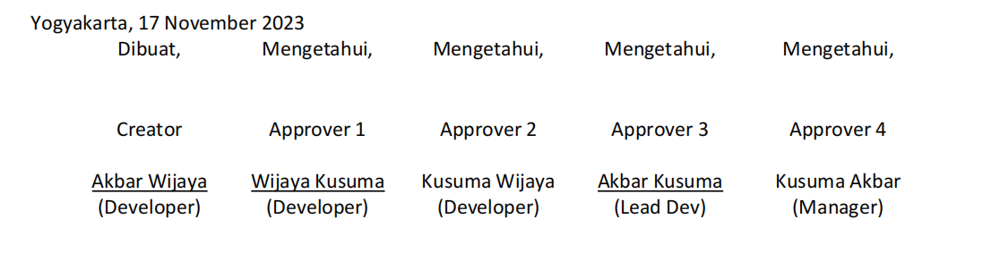
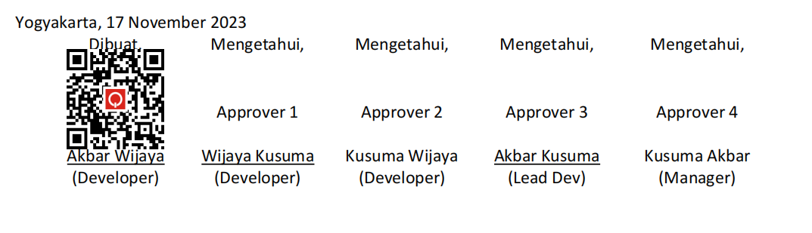
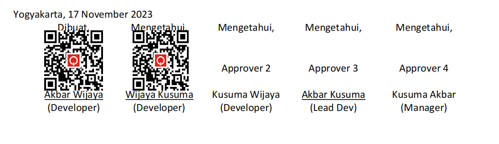

## Project Summary
Project Name : **Detect Signature Location**
<br>
Algorithm : **PaddleOCR from [PaddlePaddle](https://github.com/PaddlePaddle/PaddleOCR)**
<br>

### Overview
**Signature Location Detection API** provides an *auto-signature* feature by detecting the location of the signature on the document that needs to be approved. There are two processes handled by this API, namely _**Document Validation**_ and _**Detect Signature Location**_.

### Document Requirements
The detection process uses AI technology, so that documents to be processed **must** meet the following standard requirements:

- The inputted document is in PDF format.
- In the signature column, four (4) blank lines are provided, with a line spacing of 1 space.
- In the 3rd blank line, the words "Approver {x}" must be included as the approver identity and "Creation" as the document creator.
- The font size for the provisions in point [3] must be 12px, so that it can be clearly detected by the model.

The following is an example of the signature column format referred to in the provisions above.
<div align="center"></div>
<br>

## Quickstart
Clone this repository, add install requirements.txt.
```bash
$ git clone https://github.com/akbarwijayaa/detect-signature-location.git
$ cd detect-signature-location
$ pip install -r requirements.txt
```
<br>
<div align="left"><h3>API Documentation</h3></div>

# Endpoints
- ##  Get Info for Document Creator API
    This endpoint is used to get information that the API for the document signature creator is active. The method used is **`GET`**.
    **Endpoint**
    ```
    GET   /detect-signature-location/creation
    ```

    **Response**
    ```html
    (For Creator) API Detect Signature Location
    ```
    <br>

- ##  Document Creation 
    This endpoint serves as a signer to the document creator. The response returned is data with the type `dict`. The method used is **`POST`**.
    <br>

    **Endpoint**
    ```bash
    POST   /detect-signature-location/creation
    ```
    <br>

    **Request Body** `(form-data)` :
    * **`pdf_file`** _(file, required)_ : pdf file to detect.
    * **`url_gen`** _(string, required)_ : url for document validation.

    <br>

    **Example Request using CURL**
    ```bash
    curl --request POST 'http://localhost:2060//detect-signature-location/creation' \
    --header 'Host: localhost' \
    --header 'Content-Type: multipart/form-data; boundary=--------------------------127699220237461540409867' \
    --form 'pdf_file=@"/path/To/yourFolder/Documents.pdf"' \
    --form 'url_gen="http://your_target_url"'
    ```

    <br>

    **Creation Response**

    <div align="center"></div>

    <br>

- ##  Get Info for Signature Location Detector API
    This endpoint is used to get information that the API for the location detection process of approval in the document is active. The method used is **`GET`**.

    **Endpoint**
    ```
    GET   /detect-signature-location/predict
    ```

    **Response**
    ```html
    API Detect Signature Location
    ```
    <br>

- ##  Detect Signature Location
    This endpoint is used to detect the approver's location and then attach the QR code. The response returned is a file. The method used is **`POST`**.
    <br>

    **Endpoint**
    ```bash
    POST   /detect-signature-location/predict
    ```
    <br>

    **Request Body** `(form-data)` :
    * **`pdf_file`** _(file, required)_ : pdf file to detect.
    * **`step_approve`** _(int/number, required)_ : a number that indicates the approver level.
    * **`url_gen`** _(string, required)_ : url for document validation.

    <br>

    **Example Request using CURL**
    ```bash
    curl --request POST 'http://localhost:2060//detect-signature-location/predict' \
    --header 'Host: localhost' \
    --header 'Content-Type: multipart/form-data; boundary=--------------------------203342521398883806171571' \
    --form 'pdf_file=@"/path/To/yourFolder/Documents.pdf"' \
    --form 'step_approve="1"' \     # proses deteksi ditujukan pada approver 2
    --form 'url_gen="http://your_target_url"'
    ```
    <br>

    **Detection Result**


    <div align="center"></div>

    
# Error Handling

The Detect Signature Location API uses standard HTTP status codes to indicate the success/failure of a request.
* **200** _OK_

* **400** _bad request_

* **403** _forbidden_

* **404** _notfound_

* **405** _method not allowed_

* **408** _request timeout_

* **500** _internal server error_

* **502** _bad gateway_

* **503** _service unavailable_

* **504** _gateway timeout_


