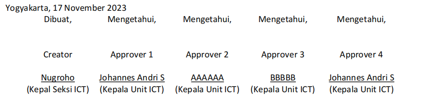

## Project Summary
Project Name : **Detect Signature Location**
<br>
Environment : `paddleocr`
<br>
Algoritma Pendekatan : OCR (Optical Character Recognition) 
<br>
Current Model : **PaddleOCR from [PaddlePaddle](https://github.com/PaddlePaddle/PaddleOCR)**

<br>

## Quickstart
Clone repository ini dengan command berikut.
```bash
$ git clone http://gitlab.quick.com/artificial-intelligence/detect-signature-location.git     #clone
$ cd detect-signature-location
```
<br>

## Dataset
Project ini memanfaatkan module PaddleOCR dengan konfigurasi default pretrained weight. Sehingga pengerjaan projek ini tidak memerlukan dataset untuk di-training ulang. Namun, kami menggunakan data uji berupa sebuah dokumen pdf yang telah memenuhi standar input model sebagai berikut:
<a id= "standar-input"></a>
-  Dokumen yang diinput berformat PDF.
-  Pada kolom tandatangan disediakan baris kosong sejumlah empat (4) baris, dengan line spacing 1 space.
-  Pada baris kosong ke-3 perlu dicantumkan tulisan "Approver {x}" sebagai approver identity dan "Creation" sebagai creator document.
-  Ukuran font untuk ketentuan pada point[3] sementara wajib 12px, agar dapat terdeteksi dengan jelas oleh model.

Berikut contoh format kolom tandatangan yang dimaksud dalam ketentuan di atas.
<br>

<div align="center"></div>

<br>

## Train & Test
Karena kami menggunakan  pretrained model dari library, maka tidak ada proses training model.
<br>

## Model Optimation
Optimasi yang kami lakukan dalam projek ini adalah dengan membuat [standar input](#standar-input) seperti ketentuan yang dijelaskan pada Dataset di atas.

<br>

## Detect Signature Location API
**API Signature Location Detection** menyediakan fitur *auto-signature* dengan mendeteksi lokasi tandatangan pada dokumen yang perlu untuk dilakukan approval. Terdapat dua proses yang ditangani oleh API ini, yaitu _**Document Creation**_ dan _**Detect Signature Location**_.
* Get Info for Document Creator API
  ```bash 
  GET   /detect-signature-location/creation
  ```
* Document Creation
  ```bash 
  POST   /detect-signature-location/creation
  ```
* Get Info for Signature Location Detector API
  ```bash 
  GET   /detect-signature-location/predict
  ```
* Detect Signature Location
  ```bash 
  POST   /detect-signature-location/predict
  ```
<br>

## Sourde Code Explanation
### > Main Detection Program 
**File Location : `main.py`** <br> Dalam modul `main.py` terdapat class `signature_world` yang berisikan fungsi untuk meng-handle proses deteksi dan penambahan QR code dalam dokumen PDF.
- #### initializing
    Bagian awal merupakan inisialisasi variabel `ocr` yang menyimpan instance dari paddleOCR sebagai model untuk pengenalan karakter.
    ```python
    class signature_world:

    
        def __init__(self):
            self.ocr = PaddleOCR(lang='en')
        
        ...

    ```

- #### `process_pdf()` function
    Fungsi `process_pdf()` menjalankan pemrosesan file pdf dengan melakukan validasi dokumen dan mendeteksi lokasi tandatangan menggunakan kata kunci "Approver". Fungsi ini memerlukan tiga argumen:
    - `pdf_bytes`, berasal dari file pdf yang telah dirubah ke dalam bytes.
    - `approve`, merupakan int yang menunjukkan approver, dengan batas maksimal 10 (int<=10).
    - `creator`, variabel boolean. Apabila `creator = True` maka proses berjalan pada creator mode, yang mana menandatangani bagan creator. Apabila `creator = False` maka proses berjalan pada approver mode, yang menandatangani bagan approver.

    <br>


    ```python
        def process_pdf(self, pdf_bytes, approve=10, creator=True):
            # Membaca dokumen yang masuk sebagai bytes
            pdf_stream = BytesIO(pdf_bytes)
            pdf_document = fitz.open(stream=pdf_stream)

            # Seleksi Creator / Approver Mode
            privileges = ["Creator"] if creator else [f"Approver {approve}"]

            # Pemrosesan pdf
            bbox, change_page = self.core_pdf(pdf_document, privileges)

            # Return bounding box, halaman diubah, dan pdf dokumen
            return bbox[0], change_page[0], pdf_document

    ```

    <br>


- #### `core_pdf()` function
    Fungsi `core_pdf()` inti dari pemrosesan file pdf dengan melakukan validasi dokumen dan mendeteksi lokasi tandatangan menggunakan kata kunci "Approver" atau "Creator". Fungsi ini memerlukan tiga argumen:
        - `pdf_doc`, file pdf yang sudah diproses.
        - `privileges`, merupakan string yang menunjukan program akan dijalankan pemrosesan creator/approver mode.

    <br>

    ```python
        def core_pdf(self, pdf_doc, privileges):
            bbox = []
            change_page = []

            # Perulangan per halaman dalam pdf
            for page_number in range(pdf_doc.page_count):
                # Membuka dokumen pdf perhalaman
                page = pdf_doc[page_number]
                rect = page.rect

                # Memproses image -> np.ndarray
                image = page.get_pixmap()
                image_array = np.frombuffer(image.samples, dtype=np.uint8)
                image_array = image_array.reshape((image.height, image.width, len(image.samples) // (image.height * image.width)))

                # Membuka gambar dari np.ndarray -> proses ocr
                image_res = Image.fromarray(image_array)
                result = self.ocr.ocr(img=np.array(image_res), det=True, rec=True, cls=True)

                # Looping hasil ocr
                for a in result[0]:
                    # Seleksi apakah sesuai dengan privileges
                    if a[1][0] in privileges:
                        # jika iya, convert bbox dan masukan ke list baru
                        x1, y1, x2, y2 = self.to_xyxy(a[0])
                        data = [x1, y1, x2, y2]
                        bbox.append(data)
                        change_page.append(page_number)

            # Return list           
            return bbox, change_page
    ...
    ```


- #### `draw_qr()` function
    Fungsi `draw_qr()` memroses file pdf yang telah dideteksi pada fungsi sebelumnya, kemudian menempelkan QR code di atas lokasi tandatangan tersebut. Fungsi ini mengambil lima argumen:
    - `pdf_bytes`, berasal dari file pdf yang telah dirubah ke dalam bytes.
    - `change_page`, merupakan int yang merujuk pada nomor halaman pdf.
    - `url`, berisi string url yang didapat dari web.
    - bbox`, memuat hasil deteksi dalam format list [x1, y1, x2, y2],
    - `pdf_document`, dokumen pdf yang menjadi objek dalam session yang berlangsung.
    - `creator=False`, (boolean) creator mode / approver mode.

    <br>

    ```python 
    ...

        def draw_qr(self, pdf_bytes, change_page, url, bbox, pdf_document, creator=False): # bbox akan berformat list
            
            logo = Image.open('img/logo.jpg').resize((40,40))
            logo_border = ImageOps.expand(logo, border=5,fill='white') 

            # generate sebuah kode QR dari url yang diberikan dan disimpan dalam bytes
            qr = qrcode.QRCode(
                error_correction=qrcode.constants.ERROR_CORRECT_H,
                border=0, 
                box_size=6
            )
            qr.add_data(url)
            qr.make()
            qrgb = qr.make_image().convert('RGB')
            
            pos = ((qrgb.size[0] - logo_border.size[0]) // 2, (qrgb.size[1] - logo_border.size[1]) // 2)
            qrgb.paste(logo_border, pos)
            
            img_byte = BytesIO()
            qrgb.save(img_byte, format='PNG')
            im_bytes = img_byte.getvalue()

            # Manipulasi size barcode (creator/approver mode)
            margin_x, margin_y = (-12 if creator else -4, -33)
            increase_x, increase_y = (11 if creator else 4, 15)
            x0, y0, x1, y1 = (bbox[0] + margin_x, bbox[1] + margin_y, bbox[2] + increase_x, bbox[3] + increase_y)

            # Proses menempel barcode ke dokumen
            image_rectangle = fitz.Rect(x0, y0, x1, y1)
            pdf_stream = BytesIO(pdf_bytes)
            file_handle = fitz.open(stream=pdf_stream)
            first_page = file_handle[change_page]
            first_page.insert_image(image_rectangle,stream=im_bytes,xref=0)
            
            pdf_document.close()
            
            return file_handle # as fitz document
    ...
    ```

- #### `to_xyxy()` function
    Fungsi `to_xyxy()` berfungsi untuk mengonversi format koordinat boundingbox, yang semula berformat [(x_min, y_min), (x_max, y_max)] menjadi format [x_min, y_min, x_max, y_max].
    ```python
        def to_xyxy(self, bbox):
            x_min, y_min = bbox[0]
            x_max, y_max = bbox[2]
            
            return int(x_min), int(y_min), int(x_max), int(y_max)
    ```

<br>

### > API Program 
**File Location : `app.py`** <br> Terdapat dua fungsi yang menjadi inti proses dari API, yaitu `detect()`, dan `val()`
- #### `detect()` function
    Fungsi `detect()` merupakan fungsi yang menangani proses deteksi lokasi tandatangan dan penambahan kode QR dalam dokumen. Fungsi ini dijalankan ketika ada request ke endpoint `/detect-signature-location/predict`. 
    ```python
    def detect():

        # mengembalikan respon dari sebuah request dengan metode 'GET'
        if request.method == "GET":
            return "API Detect Signature Location"
        
        # proses yang dijalankan apabila metode request == 'POST'
        pdf_file = request.files['pdf_file']
        pdf_bytes = pdf_file.read()     # membaca bytes dari file pdf
        
        step_approve = request.form.get('step_approve')
        url_gen = request.form.get('url_gen')
        
        crowd = signature_world()   # inisialisasi kelas `signature_world()`

        # menjalankan fungsi process_pdf() dengan argumen `creator=False` 
        # kemudian menyimpan return ke variabel `bbox`, `change_page`, `pdf_document`
        bbox, change_page, pdf_document = crowd.process_pdf(pdf_bytes=pdf_bytes, 
                                                            approve=int(step_approve),
                                                            creator=False)
        
        # menjalankan fungsi draw_qr() dan menyimpan return ke dalam variabel `result`
        result = crowd.draw_qr(pdf_bytes=pdf_bytes, 
                                    change_page=change_page, 
                                    url=url_gen,
                                    bbox=bbox,
                                    pdf_document=pdf_document,
                                    creator=False)
        
        # mengembalikan respon berupa pdf kepada user
        result_bytes = result.write()
        response = send_file(BytesIO(result_bytes), 
                            mimetype='application/pdf', 
                            as_attachment=True, 
                            download_name=f'{url_gen}.pdf')
        
        return response
    ```
- #### `creator()` function
    Fungsi `creator()` merupakan fungsi yang menangani proses creator mode pada dokumen. Fungsi ini dijalankan ketika ada request ke endpoint `/detect-signature-location/creation`. 
    ```python
    def creator():
        start_time = time.time()

        if request.method == "GET":
            return "(For Creator) API Detect Signature Location"
        
        pdf_file = request.files['pdf_file']
        pdf_bytes = pdf_file.read()
        url_gen = request.form.get('url_gen')
        
        crowd = signature_world()
        bbox, change_page, pdf_document = crowd.process_pdf(pdf_bytes=pdf_bytes, 
                                                            creator=True)
        
        result = crowd.draw_qr(pdf_bytes=pdf_bytes, 
                                    change_page=change_page, 
                                    url=url_gen,
                                    bbox=bbox,
                                    pdf_document=pdf_document,
                                    creator=True)
        
        # Mengembalikan dalam bentuk pdf
        result_bytes = result.write()
        response = send_file(BytesIO(result_bytes), 
                            mimetype='application/pdf', 
                            as_attachment=True, 
                            download_name=f'{url_gen}.pdf')

        # Append data keperluan monitoring api
        ip_addr = request.environ.get('HTTP_X_FORWARDED_FOR', request.remote_addr)
        append_data(
            id_api = 4,
            ip_address = ip_addr,
            request_date = datetime.now(),
            url_api = "http://ai.quick.com/detect-signature-location/creation",
            response = "Success",
            response_time = round((time.time() - start_time) * 100 )
        )
        return response
    ```
<br>

## Testing Program
Selalu lakukan testing program langsung menggunakans serverai. Lakukan ssh ke server ai dengan serverai@192.168.168.195. Gunakan environment yang sesuai dengan penjelasan diatas. Running program python seperti biasa, python app.py. Pastikan saat itu port tidak terpakai oleh aplikasi lain. Jika program sudah berjalan, lakukan pengujian dengan mengirimkan gambar sample delam api.

Lihat dokumentasi api selengkapnya [disini](http://ai.quick.com/documentation/detect-signature-location//).

