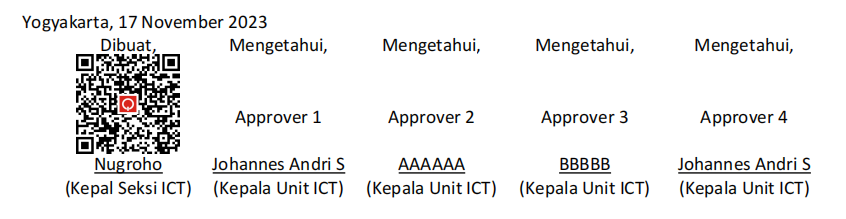
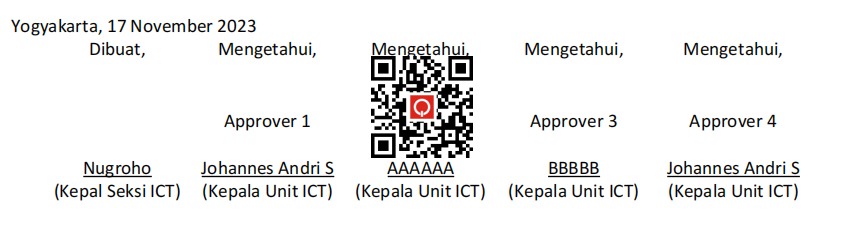

# Detect Signature Location</h3> 

### Overview
**API Signature Location Detection** menyediakan fitur *auto-signature* dengan mendeteksi lokasi tandatangan pada dokumen yang perlu untuk dilakukan approval. Terdapat dua proses yang ditangani oleh API ini, yaitu _**Document Validation**_ dan _**Detect Signature Location**_.

### Document Requirements


Proses deteksi menggunakan teknologi AI, sehingga dokumen yang akan diproses **harus** memenuhi standar ketentuan berikut:

-  Dokumen yang diinput berformat PDF.
-  Pada kolom tandatangan disediakan baris kosong sejumlah empat (4) baris, dengan line spacing 1 space.
-  Pada baris kosong ke-3 perlu dicantumkan tulisan "Approver {x}" sebagai approver identity dan "Creation" sebagai creator document.
-  Ukuran font untuk ketentuan pada point[3] sementara wajib 12px, agar dapat terdeteksi dengan jelas oleh model.

Berikut contoh format kolom tandatangan yang dimaksud dalam ketentuan di atas.

<div align="center"></div>

<br>

# <div align="left"><h3>API Documentation</h3></div>

# Base URL

```bash
http://ai.quick.com
```
Seluruh jenis request menuju server AI menggunakan base URL tersebut.

<br>

# Endpoints
- ##  Get Info for Document Creator API
    Endpoint ini digunakan untuk mendapatkan informasi bahwa API untuk signature creator dokumen telah aktif. Metode yang digunakan adalah **`GET`**.

    **Endpoint**
    ```
    GET   /detect-signature-location/creation
    ```

    **Response**
    ```html
    (For Creator) API Detect Signature Location
    ```
    <br>

- ##  Document Creation 
    Endpoint ini berfungsi sebagai pemberi tanda tangan kepada creator dokumen. Respon yang dikembalikan berupa data dengan tipe `dict`. Metode yang digunakan adalah **`POST`**.
    <br>

    **Endpoint**
    ```bash
    POST   /detect-signature-location/creation
    ```
    <br>

    **Request Body** `(form-data)` :
    * **`pdf_file`** _(file, required)_ : file pdf untuk dideteksi.
    * **`url_gen`** _(string, required)_ : url untuk validasi dokumen.

    <br>

    **Example Request using CURL**
    ```bash
    curl --request POST 'http://ai.quick.com//detect-signature-location/creation' \
    --header 'Host: ai.quick.com' \
    --header 'Content-Type: multipart/form-data; boundary=--------------------------127699220237461540409867' \
    --form 'pdf_file=@"/path/To/yourFolder/Documents.pdf"' \
    --form 'url_gen="http://ai.quick.com"'
    ```

    <br>

    **Creation Response**

    <div align="center"></div>

    <br>

- ##  Get Info for Signature Location Detector API
    Endpoint ini digunakan untuk mendapatkan informasi bahwa API untuk proses deteksi lokasi approval dalam dokumen telah aktif. Metode yang digunakan adalah **`GET`**.

    **Endpoint**
    ```
    GET   /detect-signature-location/predict
    ```

    **Response**
    ```html
    API Detect Signature Location
    ```
    <br>

- ##  Detect Signature Location
    Endpoint ini digunakan untuk mendeteksi lokasi approver kemudian menempelkan QR-code. Respon yang dikembalikan berupa file. Method yang digunakan adalah **`POST`**.
    <br>

    **Endpoint**
    ```bash
    POST   /detect-signature-location/predict
    ```
    <br>

    **Request Body** `(form-data)` :
    * **`pdf_file`** _(file, required)_ : file pdf untuk dideteksi.
    * **`step_approve`** _(int/number, required)_ : angka yang menunjuk pada level approver.
    * **`url_gen`** _(string, required)_ : url untuk validasi dokumen.

    <br>

    **Example Request using CURL**
    ```bash
    curl --request POST 'http://ai.quick.com//detect-signature-location/predict' \
    --header 'Host: ai.quick.com' \
    --header 'Content-Type: multipart/form-data; boundary=--------------------------203342521398883806171571' \
    --form 'pdf_file=@"/path/To/yourFolder/Documents.pdf"' \
    --form 'step_approve="2"' \     # proses deteksi ditujukan pada approver 2
    --form 'url_gen="http://ai.quick.com"'
    ```
    <br>

    **Detection Result**


    <div align="center"></div>


    
# Error Handling

Detect Signature Location API menggunakan standar HTTP status code sebagai indikasi sukses/gagal sebuah request.
* **200** _OK_

* **400** _bad request_

* **403** _forbidden_

* **404** _notfound_

* **405** _method not allowed_

* **408** _request timeout_

* **500** _internal server error_

* **502** _bad gateway_

* **503** _service unavailable_

* **504** _gateway timeout_
